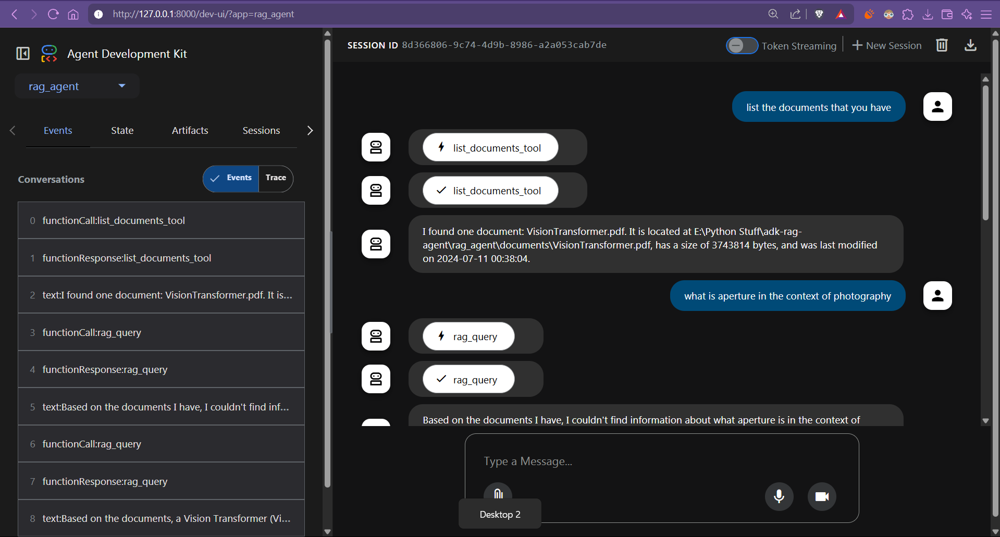
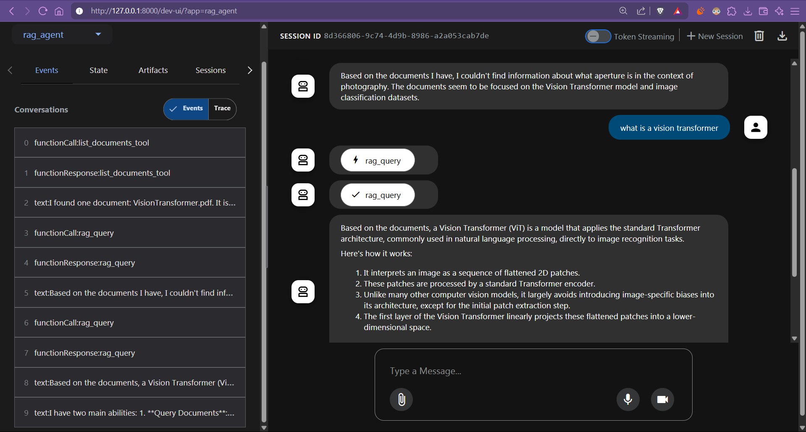

# Local RAG Agent with ADK

A local RAG (Retrieval-Augmented Generation) agent that uses local storage and FAISS for vector similarity search. This implementation is designed to work with a fixed vector store that is set up once using the provided utility script.

## Overview

The RAG agent provides semantic search capabilities over your documents using local storage and FAISS for vector similarity search. The vector store is set up once using the `setup_vector_store.py` utility script, and then the agent can be used to query the documents.




## Usage

Once the vector store is set up, you can use the RAG agent to:

1. Query documents:
   ```python
   from rag_agent.tools import rag_query
   
   results = rag_query(
       corpus_name="your_corpus",
       query="What are the key findings in the research?",
       max_results=5
   )
   ```

2. List available corpora:
   ```python
   from rag_agent.tools import list_corpora
   
   corpora = list_corpora()
   ```

3. Get corpus information:
   ```python
   from rag_agent.tools import get_corpus_info
   
   info = get_corpus_info("your_corpus")
   ```

## Storage Structure

The system stores data under `~/.rag_agent/`:
- `~/.rag_agent/corpora/<corpus_name>/files/`: Original documents
- `~/.rag_agent/corpora/<corpus_name>/metadata.json`: Corpus metadata
- `~/.rag_agent/embeddings/<corpus_name>.faiss`: FAISS index file

## Troubleshooting

1. **File Access Issues**
   - Ensure you have read/write permissions in the `~/.rag_agent` directory
   - Check if the corpus directory exists

2. **Memory Issues**
   - Reduce chunk size in config.py if processing large documents
   - Ensure sufficient RAM for embedding computation

3. **Missing Dependencies**
   - Run `pip install -r requirements.txt` to install all required packages

## Additional Resources

- [FAISS Documentation](https://github.com/facebookresearch/faiss)
- [Sentence Transformers Documentation](https://www.sbert.net/)
- [ADK Documentation](https://github.com/microsoft/autogen-devkit)
